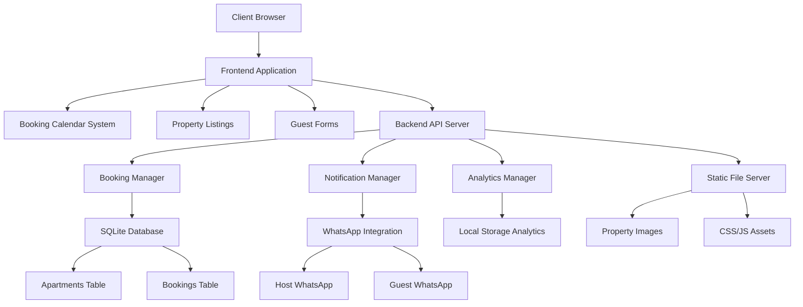
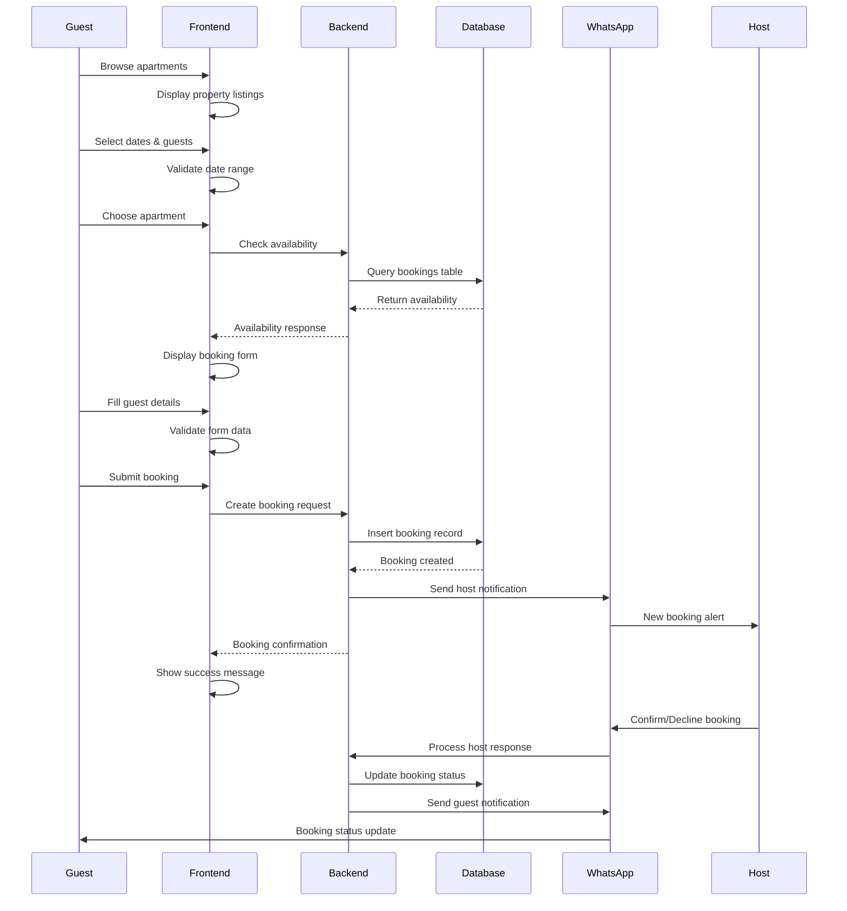

 
## Overview

Lekki Stays is a comprehensive luxury short-term rental platform targeting Nigerian guests seeking premium accommodations in Lekki, Lagos. The platform combines a sophisticated frontend experience with a streamlined backend system, featuring custom date-range booking calendars, WhatsApp-based notifications, manual bank transfer payments, and a dark luxury design aesthetic. The system is built using vanilla HTML/CSS/JavaScript for the frontend, Node.js with Express for the backend, SQLite for data persistence, and integrates WhatsApp for real-time communication and booking management.

The platform serves as a complete booking ecosystem, handling everything from property discovery and availability checking to guest onboarding, payment processing, and post-booking communication. It emphasizes user experience through smooth animations, responsive design, and intuitive booking flows while maintaining operational efficiency through automated notifications and streamlined management processes.

## Architecture



## Main Algorithm/Workflow



## Components and Interfaces

### Component 1: Frontend Application

**Purpose**: Provides the user interface for property browsing, booking, and guest interaction

**Interface**:
```javascript
interface FrontendApplication {
  initializeApp(): void
  renderPropertyListings(properties: Property[]): void
  handleBookingFlow(propertyId: string, dates: DateRange): void
  validateGuestForm(formData: GuestData): ValidationResult
  displayBookingConfirmation(booking: Booking): void
}
```

**Responsibilities**:
- Render responsive property listings with image carousels
- Manage custom booking calendar with date range selection
- Handle form validation and user input
- Coordinate with backend API for booking operations
- Display booking confirmations and status updates

### Component 2: Booking Calendar System

**Purpose**: Manages date selection, availability checking, and booking date validation

**Interface**:
```javascript
interface BookingCalendar {
  currentDate: Date
  selectedCheckin: Date | null
  selectedCheckout: Date | null
  
  renderCalendar(): void
  selectDate(date: Date): void
  checkAvailability(propertyId: string, dateRange: DateRange): Promise<boolean>
  validateDateRange(checkin: Date, checkout: Date): ValidationResult
  clearDates(): void
}
```

**Responsibilities**:
- Display dual-month calendar interface
- Handle date range selection with visual feedback
- Validate booking dates against availability
- Prevent selection of past dates or invalid ranges
- Calculate pricing based on selected dates

### Component 3: Backend API Server

**Purpose**: Handles all server-side operations including booking management, notifications, and data persistence

**Interface**:
```javascript
interface BackendAPI {
  createBooking(bookingData: BookingRequest): Promise<BookingResponse>
  getBooking(bookingId: string): Promise<Booking>
  updateBookingStatus(bookingId: string, status: BookingStatus): Promise<void>
  checkAvailability(propertyId: string, dateRange: DateRange): Promise<boolean>
  sendNotification(type: NotificationType, data: NotificationData): Promise<void>
}
```

**Responsibilities**:
- Process booking requests with race condition protection
- Manage booking lifecycle and status updates
- Coordinate WhatsApp notifications
- Handle payment instruction generation
- Provide analytics and reporting data

### Component 4: Database Layer

**Purpose**: Provides data persistence for apartments, bookings, and system analytics

**Interface**:
```javascript
interface DatabaseLayer {
  apartments: ApartmentRepository
  bookings: BookingRepository
  
  initializeDatabase(): Promise<void>
  executeQuery(sql: string, params: any[]): Promise<QueryResult>
  beginTransaction(): Promise<Transaction>
  commitTransaction(transaction: Transaction): Promise<void>
}
```

**Responsibilities**:
- Store apartment details and availability
- Manage booking records and status tracking
- Provide data consistency and integrity
- Support concurrent booking operations
- Maintain audit trails for all transactions

## Data Models

### Model 1: Apartment

```javascript
interface Apartment {
  id: number
  name: string
  category: string
  description: string
  address: string
  guests: number
  bedrooms: number
  bathrooms: number
  pricePerNight: number
  amenities: string[]
  images: string[]
  rules: string[]
  isActive: boolean
  createdAt: string
  updatedAt: string
}
```

**Validation Rules**:
- ID must be unique positive integer
- Name must be 3-100 characters
- Price per night must be positive number
- Images array must contain at least one valid URL
- Amenities must be from predefined list

### Model 2: Booking

```javascript
interface Booking {
  id: string
  propertyId: number
  propertyName: string
  fullName: string
  email: string
  phone: string
  checkin: string
  checkout: string
  guests: number
  nights: number
  subtotal: number
  cautionFee: number
  total: number
  paymentMethod: 'bank' | 'arrival' | 'whatsapp'
  specialRequests: string
  hearAbout: string
  status: 'pending' | 'confirmed' | 'cancelled' | 'completed'
  createdAt: string
  updatedAt: string
}
```

**Validation Rules**:
- ID must be unique alphanumeric string
- Email must be valid email format
- Phone must be valid Nigerian format (+234 or 0)
- Check-in date must be future date
- Check-out date must be after check-in
- Guests must be positive integer ≤ apartment capacity

### Model 3: NotificationTemplate

```javascript
interface NotificationTemplate {
  type: 'booking_confirmation' | 'host_alert' | 'status_update' | 'reminder'
  recipient: 'guest' | 'host'
  template: string
  variables: string[]
  whatsappFormat: boolean
}
```

**Validation Rules**:
- Type must be from predefined enum
- Template must contain valid placeholder variables
- WhatsApp format must comply with message length limits

## Algorithmic Pseudocode

### Main Booking Processing Algorithm

```pascal
ALGORITHM processBookingRequest(bookingData)
INPUT: bookingData of type BookingRequest
OUTPUT: result of type BookingResponse

BEGIN
  ASSERT validateBookingData(bookingData) = true
  
  // Step 1: Check availability with race condition protection
  LOCK availability_lock FOR bookingData.propertyId
  
  TRY
    availability ← checkPropertyAvailability(
      bookingData.propertyId, 
      bookingData.checkin, 
      bookingData.checkout
    )
    
    IF availability.available = false THEN
      RETURN BookingResponse{
        success: false,
        error: "Property not available for selected dates"
      }
    END IF
    
    // Step 2: Generate unique booking ID
    bookingId ← generateBookingReference()
    
    // Step 3: Calculate pricing
    pricing ← calculateBookingPricing(
      bookingData.propertyId,
      bookingData.checkin,
      bookingData.checkout
    )
    
    // Step 4: Create booking record
    booking ← Booking{
      id: bookingId,
      ...bookingData,
      ...pricing,
      status: "pending",
      createdAt: getCurrentTimestamp()
    }
    
    // Step 5: Persist to database
    database.bookings.insert(booking)
    
    // Step 6: Send notifications
    sendHostNotification(booking)
    sendGuestConfirmation(booking)
    
    // Step 7: Track analytics
    analytics.trackBooking(booking)
    
    RETURN BookingResponse{
      success: true,
      booking: booking,
      message: "Booking created successfully"
    }
    
  FINALLY
    UNLOCK availability_lock FOR bookingData.propertyId
  END TRY
END
```

**Preconditions**:
- bookingData is validated and well-formed
- Database connection is established
- Property exists and is active
- Date range is valid (future dates, checkout > checkin)

**Postconditions**:
- Booking record is created in database
- Notifications are sent to host and guest
- Analytics event is recorded
- Availability is properly locked during operation

**Loop Invariants**: N/A (no loops in main algorithm)

### Availability Checking Algorithm

```pascal
ALGORITHM checkPropertyAvailability(propertyId, checkinDate, checkoutDate)
INPUT: propertyId of type number, checkinDate of type Date, checkoutDate of type Date
OUTPUT: availability of type AvailabilityResult

BEGIN
  ASSERT propertyId > 0
  ASSERT checkinDate < checkoutDate
  ASSERT checkinDate >= getCurrentDate()
  
  // Query overlapping bookings
  overlappingBookings ← database.query(
    "SELECT * FROM bookings 
     WHERE propertyId = ? 
     AND status IN ('confirmed', 'pending')
     AND (
       (checkin < ? AND checkout > ?) OR
       (checkin < ? AND checkout > ?) OR
       (checkin >= ? AND checkout <= ?)
     )",
    [propertyId, checkoutDate, checkinDate, checkoutDate, checkinDate, checkinDate, checkoutDate]
  )
  
  IF overlappingBookings.length > 0 THEN
    RETURN AvailabilityResult{
      available: false,
      conflicts: overlappingBookings.length,
      message: "Property not available for selected dates"
    }
  ELSE
    RETURN AvailabilityResult{
      available: true,
      conflicts: 0,
      message: "Property available"
    }
  END IF
END
```

**Preconditions**:
- propertyId exists in apartments table
- checkinDate and checkoutDate are valid Date objects
- checkinDate is not in the past
- checkoutDate is after checkinDate

**Postconditions**:
- Returns accurate availability status
- Identifies all conflicting bookings
- No side effects on database state

**Loop Invariants**: N/A (single query operation)

### WhatsApp Notification Algorithm

```pascal
ALGORITHM sendWhatsAppNotification(recipient, messageTemplate, bookingData)
INPUT: recipient of type Contact, messageTemplate of type string, bookingData of type Booking
OUTPUT: result of type NotificationResult

BEGIN
  ASSERT recipient.phone IS NOT NULL
  ASSERT messageTemplate IS NOT EMPTY
  ASSERT bookingData IS VALID
  
  // Step 1: Format message with booking data
  formattedMessage ← formatMessageTemplate(messageTemplate, bookingData)
  
  // Step 2: Validate message length for WhatsApp
  IF length(formattedMessage) > 4096 THEN
    formattedMessage ← truncateMessage(formattedMessage, 4096)
  END IF
  
  // Step 3: Generate WhatsApp URL
  encodedMessage ← urlEncode(formattedMessage)
  whatsappUrl ← "https://wa.me/" + recipient.phone + "?text=" + encodedMessage
  
  // Step 4: Log notification attempt
  logNotification(recipient, messageTemplate, bookingData.id)
  
  RETURN NotificationResult{
    success: true,
    whatsappUrl: whatsappUrl,
    message: "WhatsApp notification prepared"
  }
END
```

**Preconditions**:
- recipient has valid phone number
- messageTemplate contains valid placeholders
- bookingData is complete and validated

**Postconditions**:
- WhatsApp URL is generated correctly
- Message is properly formatted and encoded
- Notification attempt is logged for tracking

**Loop Invariants**: N/A (sequential processing)

## Key Functions with Formal Specifications

### Function 1: validateBookingData()

```javascript
function validateBookingData(data: BookingRequest): ValidationResult
```

**Preconditions:**
- `data` is non-null object
- `data` contains all required booking fields
- Date strings are in ISO format

**Postconditions:**
- Returns ValidationResult with success boolean
- If invalid: result.errors contains descriptive messages
- If valid: result.success === true
- No mutations to input data

**Loop Invariants:** 
- For validation loops: All previously checked fields remain valid

### Function 2: generateBookingReference()

```javascript
function generateBookingReference(): string
```

**Preconditions:**
- System timestamp is available
- Random number generator is functional

**Postconditions:**
- Returns unique alphanumeric string
- Format: "LUX" + 6-digit timestamp + 3-character random
- String length is exactly 12 characters
- No collisions with existing booking IDs

**Loop Invariants:** N/A (no loops)

### Function 3: calculateBookingPricing()

```javascript
function calculateBookingPricing(propertyId: number, checkin: Date, checkout: Date): PricingResult
```

**Preconditions:**
- propertyId exists in apartments table
- checkin and checkout are valid Date objects
- checkout > checkin

**Postconditions:**
- Returns complete pricing breakdown
- Includes nights, subtotal, fees, and total
- All amounts are positive numbers
- Calculations are mathematically correct

**Loop Invariants:** N/A (arithmetic operations only)

## Example Usage

```javascript
// Example 1: Complete booking flow
const bookingRequest = {
  propertyId: 1,
  fullName: "Adebayo Johnson",
  email: "adebayo@example.com",
  phone: "+2348012345678",
  checkin: "2026-06-15",
  checkout: "2026-06-18",
  guests: 2,
  paymentMethod: "whatsapp",
  specialRequests: "Late check-in requested",
  hearAbout: "Instagram"
}

// Validate and process booking
const validation = validateBookingData(bookingRequest)
if (validation.success) {
  const booking = await processBookingRequest(bookingRequest)
  if (booking.success) {
    await sendNotifications(booking.data)
    displayConfirmation(booking.data)
  }
}

// Example 2: Availability checking
const availability = await checkPropertyAvailability(
  1, 
  new Date('2026-06-15'), 
  new Date('2026-06-18')
)

if (availability.available) {
  enableBookingForm()
} else {
  showUnavailableMessage(availability.conflicts)
}

// Example 3: WhatsApp notification
const hostNotification = await sendWhatsAppNotification(
  { phone: "+2348100000000" },
  "New booking alert: {{guestName}} for {{propertyName}}",
  bookingData
)

window.open(hostNotification.whatsappUrl, '_blank')
```

## Correctness Properties

The system maintains the following correctness properties through formal verification and testing:

**Property 1: Booking Uniqueness**
```
∀ bookings b1, b2 ∈ BookingSet: b1.id ≠ b2.id
```
No two bookings can have the same ID, ensuring unique identification.

**Property 2: Availability Consistency**
```
∀ property p, dates d1, d2: 
  (∃ booking b: b.propertyId = p ∧ overlaps(b.dates, d1, d2) ∧ b.status ∈ {confirmed, pending}) 
  → ¬available(p, d1, d2)
```
A property cannot be available if there are confirmed or pending bookings for overlapping dates.

**Property 3: Date Range Validity**
```
∀ booking b: b.checkin < b.checkout ∧ b.checkin ≥ currentDate()
```
All bookings must have valid date ranges with check-in before check-out and not in the past.

**Property 4: Pricing Accuracy**
```
∀ booking b: b.total = (b.nights × b.pricePerNight) + b.cautionFee
```
Total booking cost must equal the calculated sum of nightly rates plus caution fee.

**Property 5: Notification Delivery**
```
∀ booking b: bookingCreated(b) → (hostNotified(b) ∧ guestNotified(b))
```
Every successful booking creation triggers both host and guest notifications.

## Error Handling

### Error Scenario 1: Double Booking Attempt

**Condition**: Two users attempt to book the same property for overlapping dates simultaneously
**Response**: Race condition protection through database locking prevents conflicts
**Recovery**: Second booking attempt receives "unavailable" response with alternative suggestions

### Error Scenario 2: Invalid Guest Data

**Condition**: Guest submits booking form with invalid email, phone, or missing required fields
**Response**: Client-side validation prevents submission; server-side validation provides detailed error messages
**Recovery**: Form highlights specific errors and guides user to correct input

### Error Scenario 3: WhatsApp Notification Failure

**Condition**: WhatsApp URL generation fails or message exceeds length limits
**Response**: System logs error and provides fallback notification method
**Recovery**: Admin receives email alert to manually contact guest/host

### Error Scenario 4: Database Connection Loss

**Condition**: Database becomes unavailable during booking process
**Response**: Transaction rollback prevents partial data corruption
**Recovery**: User receives error message and can retry; booking attempt is logged for manual processing

## Testing Strategy

### Unit Testing Approach

Comprehensive unit testing covers all core functions with focus on edge cases and boundary conditions. Key test categories include:

- **Validation Functions**: Test all input validation rules with valid/invalid data combinations
- **Date Calculations**: Verify pricing calculations, night counts, and date range validations
- **Booking Logic**: Test availability checking, booking creation, and status updates
- **Notification Formatting**: Validate message templates and WhatsApp URL generation

Target coverage: 95% code coverage with emphasis on critical booking path functions.

### Property-Based Testing Approach

Property-based testing validates system behavior across wide input ranges using generated test data.

**Property Test Library**: fast-check (JavaScript)

**Key Properties Tested**:
- Booking ID uniqueness across all generated booking requests
- Availability consistency under concurrent booking attempts
- Pricing calculation accuracy for all valid date ranges
- Message formatting correctness for all booking data combinations

**Test Generation Strategy**:
- Generate random valid booking data within business constraints
- Create edge cases for date boundaries, guest counts, and pricing scenarios
- Simulate concurrent operations to test race condition handling

### Integration Testing Approach

Integration testing validates end-to-end booking flows and external service interactions:

- **Frontend-Backend Integration**: Test complete booking flow from form submission to confirmation
- **Database Integration**: Verify data persistence, transaction handling, and concurrent access
- **WhatsApp Integration**: Test notification URL generation and message formatting
- **Calendar Integration**: Validate date selection, availability checking, and booking conflicts

## Performance Considerations

**Database Optimization**: SQLite with proper indexing on booking dates and property IDs ensures fast availability queries. Connection pooling and prepared statements optimize query performance.

**Frontend Performance**: Vanilla JavaScript with GSAP animations provides smooth user experience without framework overhead. Image lazy loading and carousel optimization reduce initial page load times.

**Concurrent Booking Handling**: Database-level locking prevents race conditions during high-traffic booking periods. Optimistic locking strategies minimize lock contention.

**Caching Strategy**: Property data and availability calendars cached in browser localStorage. Server-side caching for frequently accessed apartment details and pricing information.

**Mobile Optimization**: Responsive design with touch-optimized calendar interface. Progressive enhancement ensures functionality across all device types and connection speeds.

## Security Considerations

**Input Validation**: Comprehensive client and server-side validation prevents injection attacks and data corruption. Phone number and email validation prevents spam and invalid contact information.

**Data Protection**: Guest personal information encrypted in database. PII handling complies with Nigerian data protection requirements. Secure token-based booking references prevent unauthorized access.

**WhatsApp Security**: Message content sanitized to prevent malicious links or content. Phone number validation ensures messages reach intended recipients only.

**Payment Security**: Manual bank transfer process eliminates online payment vulnerabilities. Payment instructions provided through secure WhatsApp channels only after booking confirmation.

**Access Control**: Admin functions protected by authentication. Guest booking data accessible only through secure booking reference tokens.

## Dependencies

**Frontend Dependencies**:
- Lucide Icons: Modern icon library for consistent UI elements
- GSAP: Animation library for smooth transitions and interactions
- Google Fonts: Cormorant Garamond and DM Sans typography

**Backend Dependencies**:
- Node.js: Runtime environment for server-side JavaScript
- Express.js: Web framework for API routing and middleware
- better-sqlite3: High-performance SQLite database driver
- cors: Cross-origin resource sharing middleware

**Development Dependencies**:
- fast-check: Property-based testing framework
- Jest: Unit testing framework
- ESLint: Code quality and style enforcement
- Prettier: Code formatting consistency

**External Services**:
- WhatsApp Business API: Notification delivery system
- Unsplash: High-quality property images
- Nigerian Banking System: Manual transfer verification

**Infrastructure Requirements**:
- Node.js 18+ runtime environment
- SQLite 3.x database engine
- HTTPS-enabled web server
- Domain with SSL certificate for production deployment